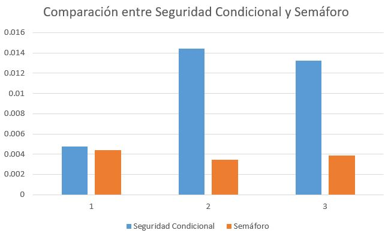
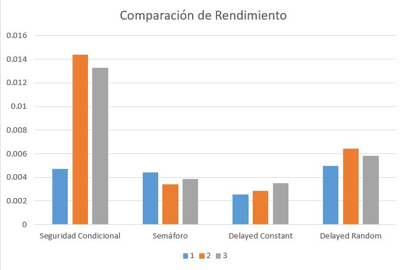

# Enunciado 

---

Ejecute al menos tres veces los códigos de Ejemplo 7 (imprimir en orden con semáforos) y Ejemplo 8 (imprimir en orden con seguridad condicional) con tantos hilos como su sistema operativo permite.

Anote las tres duraciones de cada solución. Tome la mayor duración de las tres corridas de cada versión. Agregue los resultados a sus cuadros y gráficos del Ejercicio 15 [delayed_busy_wait].

Si en un proyecto con sus clientes usted tuviere que implementar una de las cuatro soluciones para hacer un trabajo en orden ¿Cuál solución escogería? Agregue además un párrafo a la discusión de Ejercicio 15 [delayed_busy_wait] explicando la potencial causa de este comportamiento.

# Semáforo y Seguridad Condicional

---

## Análisis 

---

El gráfico muestra que los semáforos son más eficientes que la seguridad condicional al ejecutarlo 3 veces, probablemente porque requieren menos pasos de sincronización y no implican espera activa ni verificación constante de condiciones.

Si el objetivo principal es rendimiento, los semáforos parecen ser la mejor elección para este caso específico de control del orden de saludo entre hilos.

# Comparación Ampliada con Delayed Busy Wait

---

## Tabla Comparativa

| Técnica               | 1         | 2         | 3         | Mayor Duración |
|-----------------------|-----------|-----------|-----------|----------------|
| Seguridad Condicional | 0.0047262 | 0.0143952 | 0.0132562 | 0.0143952      |
| Semáforo              | 0.0044113 | 0.0034302 | 0.0038653 | 0.0044113      |
| Delayed Constant      | 0.0025772 | 0.0028568 | 0.0035326 | 0.0035326      |
| Delayed Random        | 0.0049523 | 0.0064087 | 0.0058423 | 0.0064087      |

 

## Gráfico de Barras

 

# Conclusión

---

Tras analizar los resultados obtenidos, concluimos que el uso de semáforos es la opción más adecuada en un entorno laboral si queremos optimizar la velocidad de ejecución, ya que fue la técnica que presentó los mejores (más cortos) tiempos de ejecución. Dentro de las cuatro alternativas evaluadas, los semáforos ofrecen un equilibrio eficaz entre rendimiento y control de concurrencia, posicionándose como la solución más eficiente para tareas que requieren sincronización. 

La espera activa debe evitarse, ya que implica un uso constante de CPU mientras los hilos esperan, lo que aumenta de manera innecesaria el overhead del sistema. Esta estrategia puede afectar negativamente el rendimiento. 
