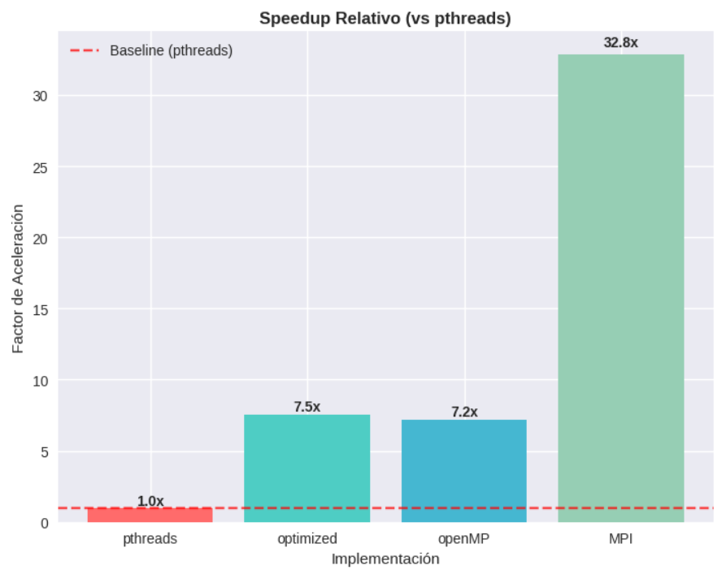
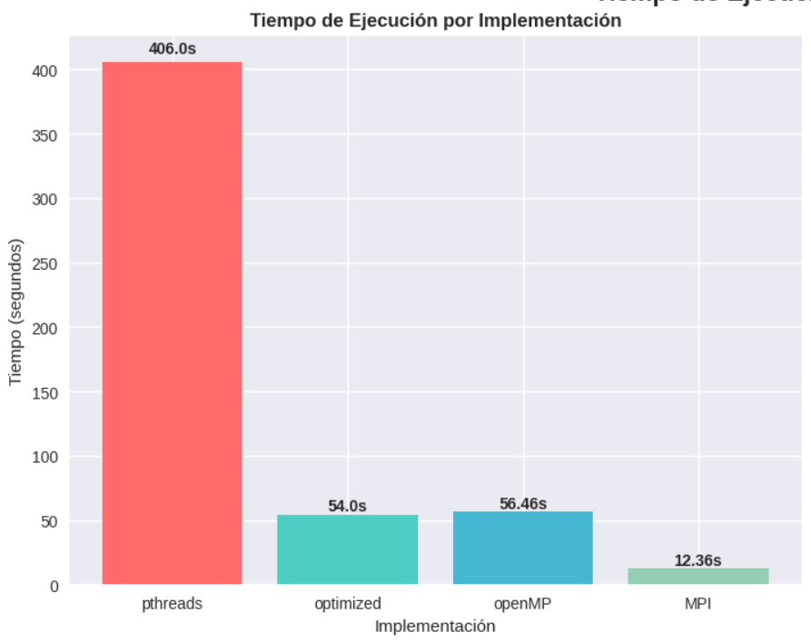
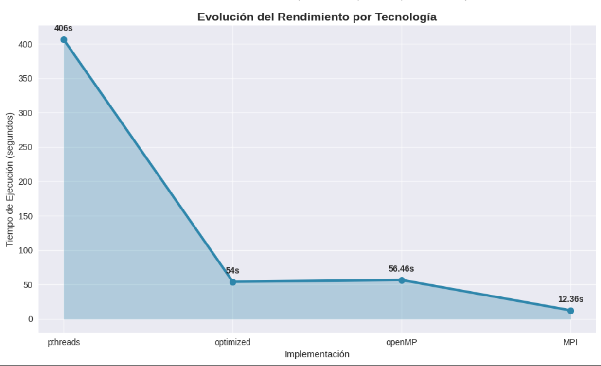
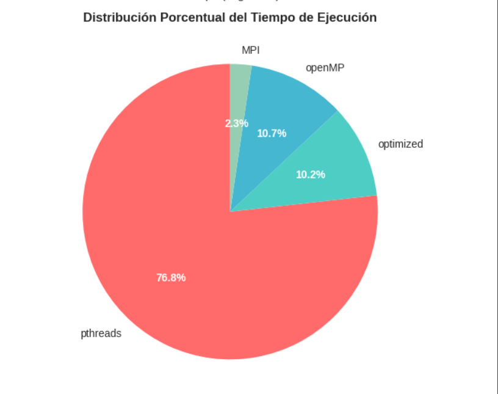

# Análisis de Rendimiento de Implementaciones Paralelas

## Introducción

Este documento presenta un análisis comparativo del rendimiento de una simulación de calor en placas implementada utilizando cuatro tecnologías diferentes de programación paralela: **pthreads**, **pthreads optimizado**, **OpenMP** y **MPI**. Los resultados muestran diferencias significativas en términos de tiempo de ejecución y aceleración.

## Metodología

Se implementó la misma tarea computacional utilizando:
- **pthreads**: Implementación básica con hilos POSIX
- **optimized**: Versión optimizada de pthreads con mejoras en la gestión de hilos
- **openMP**: Implementación usando OpenMP para paralelización automática
- **MPI**: Implementación distribuida usando Message Passing Interface

## Resultados

### Speedup Relativo

El análisis del speedup relativo muestra una jerarquía de rendimiento:

- **MPI** logra el mejor rendimiento con un factor de aceleración de **32.8x**, superando significativamente a las demás implementaciones
- **pthreads optimizado** y **OpenMP** muestran rendimientos similares con **7.5x** y **7.2x** respectivamente
- **pthreads básico** sirve como línea base (1.0x) para las comparaciones

### Distribución del Tiempo de Ejecución

La distribución porcentual del tiempo total de ejecución muestra:

- **pthreads** consume el **76.8%** del tiempo total, siendo la implementación menos eficiente
- Las implementaciones **optimizada** (10.2%) y **OpenMP** (10.7%) tienen contribuciones similares y moderadas
- **MPI** representa solo el **2.3%** del tiempo total, confirmando su superior eficiencia

### Evolución del Rendimiento

El gráfico de evolución muestra una mejora dramática en el rendimiento:

1. **pthreads**: 406 segundos (punto de partida)
2. **optimized**: 54 segundos (mejora sustancial)
3. **openMP**: 56.46 segundos (rendimiento similar al optimizado)
4. **MPI**: 12.36 segundos (mejor rendimiento absoluto)

### Comparación Absoluta de Tiempos

Los tiempos de ejecución confirman las tendencias observadas:

- **pthreads**: 406.0s (línea base)
- **optimized**: 54.0s (7.5x más rápido)
- **openMP**: 56.46s (7.2x más rápido)
- **MPI**: 12.36s (32.8x más rápido)

## Análisis y Conclusiones

### Factores Clave del Rendimiento

1. **Superioridad de MPI**: La implementación MPI demuestra una eficiencia excepcional, posiblemente debido a:
   - Mejor distribución de la carga de trabajo
   - Comunicación optimizada entre procesos
   - Aprovechamiento de múltiples núcleos/nodos de procesamiento

2. **Rendimiento Similar de OpenMP y pthreads Optimizado**: Ambas tecnologías muestran rendimientos comparables, sugiriendo que:
   - Las optimizaciones en pthreads pueden igualar la eficiencia de OpenMP
   - OpenMP proporciona un balance entre facilidad de implementación y rendimiento

3. **Limitaciones de pthreads Básico**: La implementación básica de pthreads muestra:
   - Overhead significativo en la gestión manual de hilos
   - Posibles problemas de sincronización
   - Falta de optimizaciones específicas

### Recomendaciones

**Para aplicaciones de alto rendimiento**: MPI es claramente la opción preferida cuando se requiere máximo rendimiento, especialmente en entornos distribuidos.

**Para desarrollo rápido con buen rendimiento**: OpenMP ofrece un excelente balance entre facilidad de implementación y rendimiento, siendo ideal para la mayoría de aplicaciones paralelas.

**Para control granular**: pthreads optimizado puede ser una opción cuando se requiere control específico sobre el comportamiento de los hilos, pero requiere mayor expertise en programación paralela.

### Escalabilidad

Los resultados sugieren que MPI tiene el mayor potencial de escalabilidad, mientras que las implementaciones basadas en memoria compartida (pthreads y OpenMP) pueden tener limitaciones en sistemas con muchos núcleos o en entornos distribuidos.

## Conclusión

Este análisis demuestra la importancia de elegir la tecnología de paralelización adecuada según los requisitos específicos del proyecto. MPI se destaca como la opción de mayor rendimiento, mientras que OpenMP ofrece la mejor relación facilidad-rendimiento para la mayoría de casos de uso.